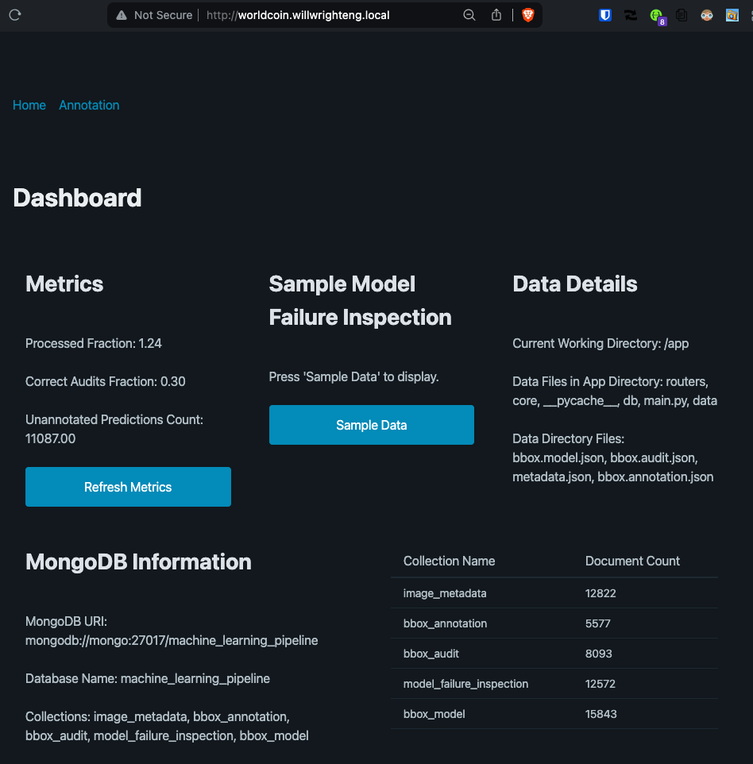
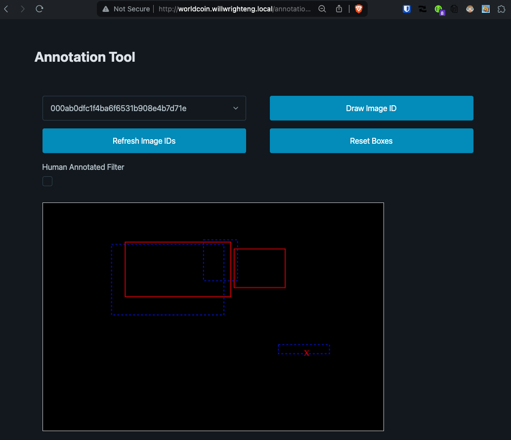
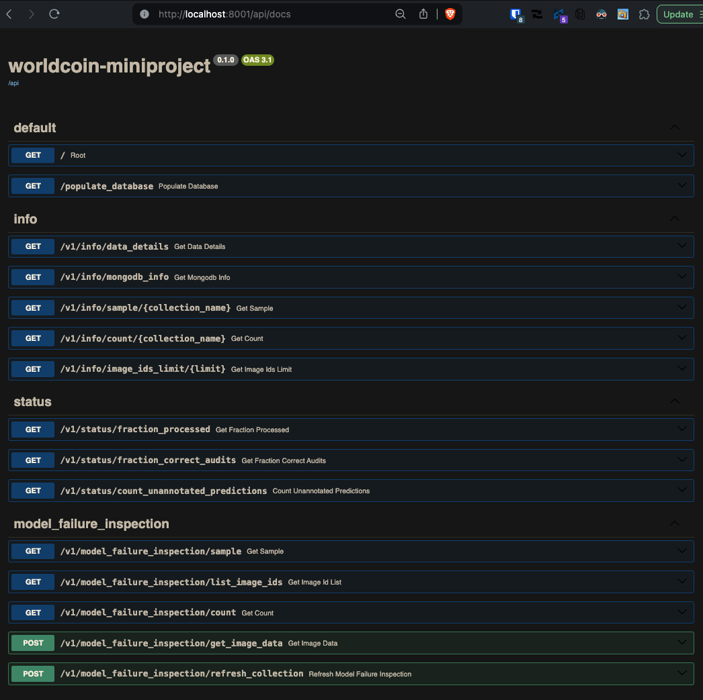

# worldcoin-miniproject

## Problem Statement

- [Worldcoin AI Miniprojects Dashboard](https://dashboard-miniprojects.ml-stage.worldcoin.org/)

> Your passphrase expires on 2024-04-10!

## Project Description

This project involves developing a data processing pipeline for a face detection system as part of a Data Engineering role at TfH for the Worldcoin project. The tasks focus on handling image metadata and bounding box information without actual image data, using MongoDB for storage. Key tasks include setting up a MongoDB instance with provided data, monitoring bounding box data status, inspecting model prediction failures against human annotations, and creating a final dataset prioritizing recent human annotations for model training. The project emphasizes code quality, documentation, and the ability to make assumptions to progress in the absence of complete information.

## Setup

The following software is required to run this project locally:

- [Docker](https://docs.docker.com/engine/install/)
- [Docker Compose](https://docs.docker.com/compose/install/)
- [Make](https://www.gnu.org/software/make/#download)

## Usage

To start the project, rename `.env.example` to `.env` and update the values to match your local setup (ie `nginx.conf`). Then run the following commands:

```bash
cd site
# Open the frontend & backend UIs in the default browser
make open
# Run the project locally
make local
```

If you're running `make local` for the first time then it will take some time to pull the images and start the containers. You can remove the `--build` flag within the `Makefile` to speed up the process in successive runs.

Navigate to [http://localhost](http://localhost) to view the frontend UI -- the homepage will display information about the contents of the MongoDB instance. If MongoDB Information does not display collections corresponding to each json file (and json files are listed under the Data Details section) then navigate to [http://localhost:8001/api/docs](http://localhost:8001/api/docs) to view the Swagger Docs and execute the root endpoint `/populate_database`.

## Optional

I prefer to use `dnsmasq` for local development because it allows me to use wildcard routing with my nginx service. Plus it avoids any CORS issues.

You can implement this within the `.env` file -- you'll see my domain name mask within the dotenv file and `nginx.conf`.

- [Dnsmasq - network services for small networks.](https://dnsmasq.org/doc.html)

## User Interface

`Dashboard Page`



`Annotation Tool`



`Swagger Docs`



## Feature Creep (aka Future Work)

- frontend
  - dashboard
    - real-time updates (server-side events)
  - annotation tool
    - save canvas
    - load annotated image
- backend
  - add unit testing
  - add integration testing
  - load testing
